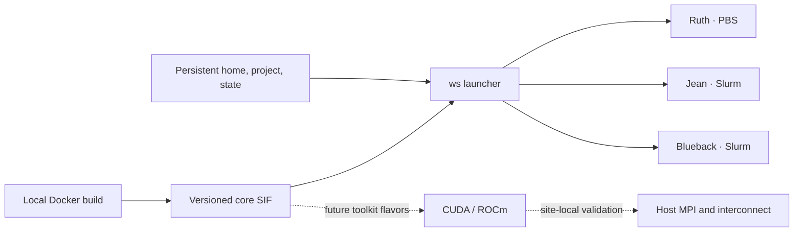

# HPC workspace

A versioned Linux development environment for Ruth (PBS), Jean (Slurm), and Blueback (Slurm). Build it locally with Docker, transfer a SIF, and enter it with the same `ws` interface on each system. No cluster connection is needed to build the baseline.

The current release is **core / linux-amd64**: Ubuntu 24.04, Neovim 0.12.5, tmux, Git, ripgrep, fd, fzf, bat, jq, Python, Node 24, C/C++/Fortran compilers, CMake, Ninja, GDB, clangd, ShellCheck, shfmt, htop, Codex 0.155.1, and Claude Code 2.1.278. It includes the updated Matt Pocock skills and `find-skills`.

The image carries its own glibc. The initial runtime target is **Apptainer 1.3.6 through 1.5**. CPU architecture, host kernel capabilities, and any host libraries added later still matter; local validation results are recorded in [validation.md](docs/validation.md).

The intended direction remains a **thin container with consistent tools and dotfiles, integrated with the cluster**. The [implementation plan](docs/thin-container-plan.md) recommends Nix-packaged development tools inside the SIF and an explicitly tested host filesystem/runtime recipe, following the Open OnDemand pattern. It maps mounts, modules, scheduler behavior, local configuration, and rollout; no new runtime is implemented yet. The [toolkit roadmap](docs/toolkit-roadmap.md) builds on that pilot. For the reported tmux startup and bat library errors, use the [local troubleshooting guide](docs/troubleshooting-startup.md); their cluster-side causes remain unconfirmed.

## What is built now



The core deliberately has no MPI implementation or GPU compiler toolkit. `--gpu cuda` and `--gpu rocm` request Apptainer device/library passthrough inside an existing allocation. They do not install CUDA/ROCm or establish driver compatibility. Future toolkit images should retain this launcher, configuration, and persistent-state interface.

Nix is not a prerequisite. The Dockerfile pins base-image digests, uses a dated Ubuntu package snapshot, locks npm dependencies, and checks downloaded editor/plugin archives. This gives us a manageable first release; Nix can be introduced on the builder if maintaining the package set later justifies it. Archive checksums identify the actual delivered bytes; separate rebuilds are not promised to be bit-for-bit identical.

## Transfer and first launch

Get the files from the [0.4.0-preview1 release](https://github.com/ray12514/hpc-workspace/releases/tag/v0.4.0-preview1), or use the local copies in `dist/`. The [transfer and startup guide](docs/transfer.md) walks through downloading, verifying, and starting the environment on each cluster. A GitHub account, Docker Hub account, or container registry is not needed to download the public release.

Transfer these files using your approved transfer method:

- `hpc-workspace-core-0.4.0-preview1-linux-amd64.sif` and its `.sha256` file.
- `hpc-workspace-source-0.4.0-preview1.tar.gz` and its `.sha256` file. This small bundle supplies `ws`, site profiles, session configuration, and the build recipes.

The Docker archive is an alternative for another Docker builder; it is not also required on a cluster. Keep images on a suitable persistent filesystem, outside purgeable scratch if they are your only copies.

This is a **preview release**. The image contents passed the local checks described in [validation.md](docs/validation.md); normal SIF execution on the target clusters remains to be checked locally. The public repository contains generic configuration and public-source research. Site-local profiles, credentials, job data, and local reports stay on the clusters.

On the cluster, verify each transferred file with `sha256sum -c FILE.sha256`, extract the source bundle, and make `bin/ws` available. The host launcher needs Python 3.6+; it has no Python package dependencies. Load the site's Apptainer module using the site's normal instructions.

For example, after placing the source at `$HOME/hpc-workspace` and the SIF under `$HOME/containers`:

```bash
export PATH="$HOME/hpc-workspace/bin:$PATH"
ws enter --site ruth \
  --image "$HOME/containers/hpc-workspace-core-0.4.0-preview1-linux-amd64.sif" \
  --project "$HOME/my-project"
```

Use `--site jean` or `--site blueback` on those systems. Add `--work /your/work/directory` for an additional work directory. Add `--dry-run` before `--` to inspect the launch without creating state or running the container. Commands follow `--`, for example `-- nvim` or `-- python3 script.py`.

To save system defaults once, optionally import your existing local Cluster Inspector profile using the new SIF:

```bash
ws init --profile /path/to/profile.yaml --image /path/to/release.sif
```

The workspace saves the system name, scheduler default when available, and useful MPI, libfabric, module, and hardware facts. It reads the existing YAML with a parser bundled in the image; it does not run or modify Inspector. Without a profile, `ws init --site ruth` (or `jean` / `blueback`) saves one of the original defaults. A basic shell also works with just `ws enter --image FILE.sif` and a generic local state directory.

Select a default release after verifying its checksum. After setup, daily commands use the saved system settings:

```bash
ws use /path/to/release.sif --sha256 CHECKSUM_FROM_THE_SHA256_FILE
ws enter --project /path/to/project
```

`ws use` checks the full file hash before changing the selection. `ws rollback` revalidates and selects the previous image. Keep both image files. New releases use new filenames; do not overwrite a selected SIF. Running shells and sessions keep their current image. Batch jobs should always pass an explicit, versioned `--image` path. Explicit `--site` remains available for the original per-site workflow.

First entry can also import with `ws enter --profile FILE.yaml --image FILE.sif`, or a site module can supply `WS_INSPECTOR_PROFILE`. Later starts use saved settings even if the YAML is removed or changed. Use `ws refresh --dry-run` to preview an update, then `ws refresh` to import it. See [profile setup and refresh](docs/inspector-integration.md) for configuration locations, personal overrides, and shared-home setups.

## Files, configuration, and credentials

The launcher explicitly binds your home and project at their normal paths. State defaults to `${XDG_STATE_HOME:-$HOME/.local/state}/hpc-workspace/SITE` and appears inside the image at `/workspace-state`. `--state-dir` can choose another persistent location. Shell history, editor sessions, undo files, and application data live there. Caches are separated by image release.

Shared dotfiles are versioned in `image/config/` and installed under `/opt/workspace/config`, so a mounted home does not hide them. First entry creates missing personal configuration under `~/.config/hpc-workspace/`: `bashrc`, `inputrc`, `nvim.lua`, `tmux.conf`, and writable application settings under `xdg/`. Existing files and symlinks are preserved. See the [dotfile guide](docs/dotfiles.md) for loading order, customization, and updates.

The shell initializes enhanced Tab completion and fzf's **Ctrl-R** history picker, **Ctrl-T** path picker, and **Alt-C** directory picker. A history selection stays on the editable command line until you execute it.

The managed skills are copied into `~/.local/share/hpc-workspace/skills/RELEASE` on first entry, then linked into `~/.agents/skills` and `~/.claude/skills`. Existing independent skills are preserved. A local report of preserved paths is written under the state directory. Set `WS_INSTALL_SKILLS=0` before `ws enter` to skip installation. Re-enter after an image update and start new agent sessions to load the new skills.

AI authentication is performed locally on each approved system using its normal workflow. Credentials are not built into the image or transferred by this project. Existing home-based client state persists with the home bind. The launcher forwards selected API-key, proxy, certificate, terminal, and GPU-selection variables; dry-run output lists their names, not their values. A forwarded certificate path must also be visible through a bind. Automatic AI-client updates are disabled; update the image to change versions.

The daily environment uses `--cleanenv --no-eval`, resets the tool path, and does not source your host shell startup files. This is a serial development shell, not an MPI launch wrapper. Site-configured default mounts may still apply. The workspace is not a separate security boundary around the files you bind into it.

To add a site-local mount, create `profiles/ruth.local.json` (or the other site name) in the extracted source:

```json
{
  "binds": [
    {"source": "/actual/site/path", "destination": "/actual/site/path", "mode": "ro"}
  ]
}
```

Local profiles stay local and are excluded from source bundles. There is no default archive mount. Add one only for a node/context where the site's archive access is appropriate; stage data for compute work as required by the site. The bind parser supports spaces but rejects commas, colons, and newlines in paths.

## Sessions and jobs

The [daily workflow guide](docs/daily-workflow.md) covers the coordinated terminal appearance, PuTTY/VS Code client settings, native job scripts, and the optional connection for submitting from inside the container.

[See the Bash, tmux, and Neovim views](docs/previews/README.md), captured from the image with local demo data.

On an approved stable **login host**, outside a compute allocation:

```bash
ws session --site ruth --project /path/to/project
```

This uses host tmux with the shipped configuration and opens editor, host-shell, and container-shell windows. Host tmux is required (configuration tested with tmux 3.4). The server socket stays local to that host; snapshots live in persistent state, separated by site, hostname, and project. `--detach` creates the session without attaching. The same command reconnects to the same project on the same host.

Use the host window to request an interactive allocation with the site's normal command. Once allocated, enter the environment with `ws enter --site SITE --compute --image /path/to/release.sif --project /path/to/project`. Add `--gpu cuda` or `--gpu rocm` when appropriate. If that allocation ends, the login-host editor and other windows can continue.

`Ctrl-b d` detaches. `Ctrl-b Ctrl-s` saves the tmux layout; `Ctrl-b Ctrl-r` restores it. A save is also requested on detach, and periodic saves run about every 15 minutes while a client is attached. Neovim saves its layout on normal exit; `:WorkspaceSave` / Space-w-s saves it explicitly, and `:WorkspaceRestore` / Space-w-r restores it. Save modified buffers separately. Starting Neovim interactively with no filenames restores the project's saved layout.

Saved layouts do **not** migrate live processes, allocations, MPI communicators, or GPU memory. Tmux process replay is disabled, so restoration opens shells rather than automatically resubmitting remembered jobs. After a host change, `ws session` recreates the standard project recipe and Neovim can restore its saved files/layout from shared state. Older custom tmux snapshots remain under `STATE/tmux/OLD_HOST/SESSION`; use tmux-resurrect's explicit file-selection workflow if you need that exact layout. [Upstream restore instructions](https://github.com/tmux-plugins/tmux-resurrect/blob/master/docs/restoring_previously_saved_environment.md)

`ws submit --site ruth ./job.pbs` submits a native PBS script; Jean and Blueback use `ws submit --site SITE ./job.slurm`. `ws jobs --site SITE` uses the host's `qstat` or `squeue`. These commands work in the host window without an image. Add `--host-jobs` when starting `ws enter` or `ws session` on a login host to use `ws submit ./job.pbs` and `ws jobs` inside the container. The local connection uses the host's native clients and selected host environment. Put resource settings in the job script; the wrapper does not add the development image to the job. `htop` and similar container tools reflect the process/device visibility allowed by the host.

## Local site checks and later extensions

`ws doctor --site SITE --image /path/to/release.sif` prints a local environment report. `--gpu-inventory` requires an existing allocation. There is no upload function. Reports and all non-public cluster information remain on the machines; no report is required here to build or use the core.

The next site-local checks are straightforward: enter as your own UID, edit a file in the project, close/reopen the environment, reconnect to the same login-host session, and repeat a serial command in an allocation. Site runtime settings and approved binds can be adjusted locally.

For CUDA/ROCm flavors, select a vendor-supported toolkit/base for the intended hardware and driver, reuse the core configuration and tool manifest, and validate a result-checked kernel inside an allocation. For MPI, use the site's supplied container examples and host launcher; validate serial, one-node, two-node, and then GPU-aware paths where needed. Do not replace all of `/usr` or the container's glibc with host directories. The public-source [GPU/MPI notes](docs/research/gpu-mpi-sites.md) explain why the exact integration belongs to a separate site profile.

## Build, test, and update locally

Requirements: Docker with a Linux engine, Python 3.12+ for build helpers, and enough disk space for the image, archive, and unpacked conversion. The cluster-side launcher only needs Python 3.6+.

```bash
./scripts/build-image
python3 -m unittest discover -s tests -v
./scripts/test-image
./scripts/export-image
./scripts/test-sif
./scripts/package-release
```

`scripts/docker-public` uses an isolated Docker configuration for public pulls and the current Docker endpoint. It leaves your normal Docker credentials/configuration unchanged. It is for local public builds, not authenticated registry pushes. `WS_DOCKER_HOST` can select a different Docker endpoint explicitly.

The image test runs as an ordinary UID, with a read-only image, no network, no capabilities, and temporary home/project/state directories. It runs the real tools, preserves a custom skill, replaces the container, then checks persistent history/editor state and tmux layout recovery. It does not authenticate AI clients or run paid API requests.

`export-image` creates a Docker archive and converts it to a standard, unencrypted SIF with gzip SquashFS using a pinned Apptainer 1.5.3 converter. No Docker socket, host home, or network is passed into the converter. Existing release artifacts are not overwritten. See [local conversion research](docs/research/local-sif-build.md).

`test-sif` uses separate local Apptainer 1.3.6 and 1.5.3 fixtures, a non-root test user, disposable state, and no network. It defaults to `--unsquash` to extract the SIF before execution: direct nested SIF-mount execution returned `EINVAL` on the local Docker Desktop kernel, while the extracted image ran. The fixture relaxes Docker's syscall and system-path restrictions for Apptainer's namespaces/extraction helper; it does not use privileged mode. These are local test-container settings, not flags to apply on a cluster. On another suitable Linux Docker host, `WS_SIF_TEST_MODE=mount ./scripts/test-sif` exercises direct SIF mounting with `/dev/fuse`. `package-release` bundles the sources, installed-package records, and checksums after validation. When run from a Git checkout, commit tracked changes first: it archives the committed files and records that source commit, excluding ignored and untracked local files.

To update, change the intended base digests, Ubuntu snapshot date, package lock, or checked asset records, then build/test/export under a **new release name** by passing it as the first argument to those scripts. Refresh npm's lock with Node 24. Update shipped skills from the reviewed upstream revision and preserve license files. Inspect the image's `/opt/workspace/manifests` and retain the prior passing release. A dated package snapshot controls updates; it does not receive security fixes until you deliberately update and rebuild. [Ubuntu snapshot service](https://snapshot.ubuntu.com/)
