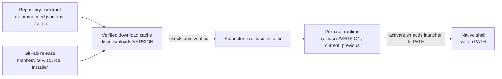
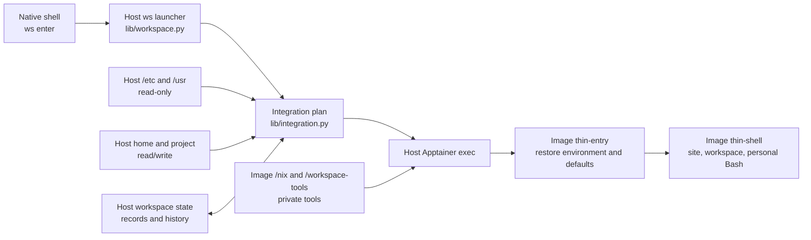
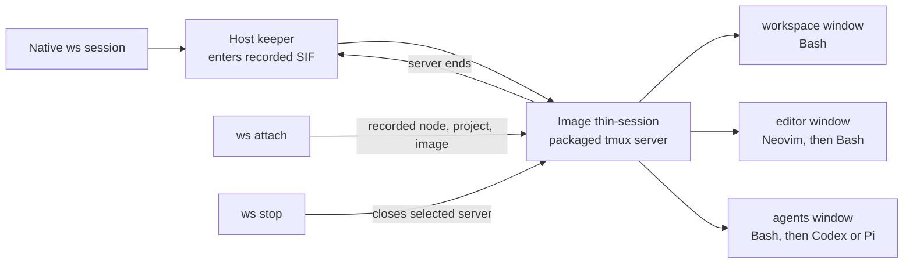

# Workspace architecture map

This map describes the **0.7.3-preview6 thin workspace**. The native Linux host starts Apptainer and owns the files and processes outside it. The image supplies the workspace tools and shell defaults. Your home, project, and site programs remain live host resources.

## 1. Install and select a release

`./setup` reads the version and manifest checksum pinned in [recommended.json](../releases/recommended.json), downloads the matching public bundle, verifies it, and runs its installer. The installer stores the image and matching source under a versioned per-user runtime and points `current` at the selected release. It adds a small activation block to Bash startup so `ws` is found on later logins. Activation **does not enter the container**. An update changes the selection for new entries; a running shell or managed session keeps its original image. See [setup and rollback](thin-start.md#updates-and-rollback).

## 2. Enter a workspace

The launcher selects the installed SIF and saved site configuration, checks the project and runtime, and constructs an Apptainer command. The thin [integration plan](../lib/integration.py) mounts the host operating-system and program directories read-only, mounts home/project/work paths read/write, and leaves `/nix` and `/workspace-tools` from the image. That is why `sbatch`, `qsub`, SSH, site modules, and project files can still come from the host while `nvim`, `tmux`, `codex`, and `pi` come from the image. A small temporary, private snapshot carries the host environment into [thin-entry](../scripts/thin-entry); its source file is removed after entry. Readable SSH client configuration is copied into temporary user-owned files for rootless OpenSSH compatibility. The host SSH files and keys are not changed.

`thin-entry` sets workspace variables, prepares per-user defaults, then starts [thin-shell](../scripts/thin-shell) for an ordinary interactive entry. The shell loads site modules and startup, workspace prompt/tool defaults, and the personal `~/.config/hpc-workspace/bashrc`. Preview6 starts the final Bash with `--norc`, then explicitly sources site `/etc/bashrc` while it can safely compose the site's read-only `PROMPT_COMMAND` with the `ws:` prompt. See the [startup explanation](troubleshooting-startup.md#prompt-command-is-read-only-or-the-workspace-label-is-missing).

`ws enter` is a foreground entry. `exit` returns to the native shell. The container command ends when that entry ends.

## 3. Keep a managed session

`ws session` starts a host keeper whose Apptainer entry runs [thin-session](../scripts/thin-session). The keeper holds the image's extracted tools available while tmux is detached. The server creates the three windows shown above. In the editor window, quitting Neovim starts a fresh workspace Bash rather than closing the window. `ws sessions` reads private location records; `ws attach` uses the recorded image on the recorded node; `ws stop` closes only the selected managed server and waits for its keeper. A session is tied to its **node, project, and release**. Files may be shared across nodes, but a tmux process does not move with them. See [session locations](session-locations.md).

## 4. Agents, settings, and credentials

The agents window is a workspace Bash. `ws agent codex NAME` or `ws agent pi NAME` launches a selected managed gateway profile; `--native` uses the agent's own configuration. Managed profiles and private credential files live in your home directory, outside the image, so an update preserves them. A stored profile credential is added to the selected agent's child environment. For the site's custom-header Codex setup, [native Codex instructions](restricted-codex.md) use a hidden key-save helper and an explicit `ws-codex-key-on` command in the shell that starts Codex. A non-secret CA path can load from the personal workspace Bash file. Other panes and already-running agents do not inherit later environment changes. See [agent profiles](agent-profiles.md).

## Where to look or change something

| Concern | Owning file or guide |
| --- | --- |
| Recommended version and `./setup` download | [recommended.json](../releases/recommended.json), [bootstrap.py](../lib/bootstrap.py) |
| Versioned install, `current`/`previous`, rollback | [releases.py](../lib/releases.py) |
| Native `ws` commands and image selection | [workspace.py](../lib/workspace.py) |
| Host mounts, environment snapshot, SSH config | [integration.py](../lib/integration.py) |
| Environment restoration inside the image | [thin-entry](../scripts/thin-entry) |
| Bash startup and `ws:` prompt | [thin-shell](../scripts/thin-shell), [bashrc](../image/config/bashrc) |
| Managed tmux windows and keeper | [thin-session](../scripts/thin-session), [session guide](session-locations.md) |
| Codex/Pi profiles and personal keys | [agent guide](agent-profiles.md), [native Codex guide](restricted-codex.md) |

For daily commands rather than internals, use the [daily workflow](daily-workflow.md) and [command reference](command-reference.md).
