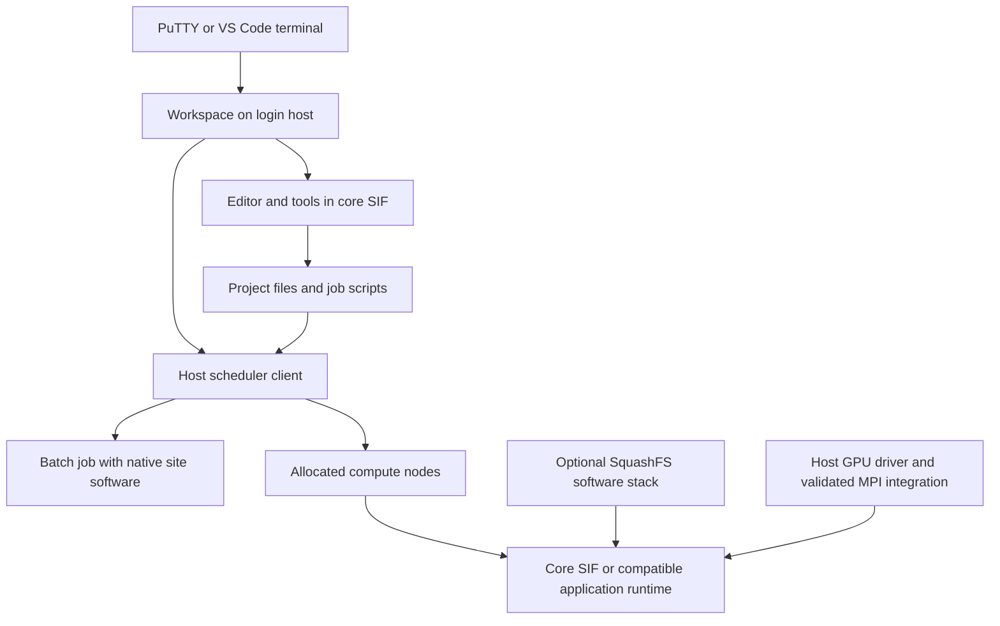

# Development workspace, native jobs, and optional software stacks

Updated: 2026-09-23. Status: **SIF daily workflow, optional Inspector import, and explicit dotfiles implemented through 0.4.0-preview1; Nix packaging and further host/scientific integration remain proposed**.

This note separates implemented workspace behavior from the proposed scientific-stack extensions. It uses public technical documentation and local source code. It does not require cluster inventories, credentials, private MPI paths, or uploaded site reports. The original 0.1.0-preview1 release remains available.

## Intended direction: a thin container integrated with the cluster

The [thin-container implementation plan](thin-container-plan.md) is the detailed next-step design. It recommends Nix for the tools inside the SIF and a validated OOD-style host-userspace recipe for broad site access, with the existing image-userspace workflow retained during the pilot. It includes the mount categories, shell/module and scheduler contracts, source changes, acceptance checks, and release sequence. The [packaging research](research/thin-container-packaging.md) records the primary-source comparison with Spack and the integration limits.

Keep the container as the portable development environment: Bash, consistent dotfiles, and selected tools with coherent dependencies. Expose the required home, project, work, and shared filesystems through appropriate binds, and integrate with the site's scheduler and scientific tools. The user proposed Nix inside the container for package management. They did not select a migration to a native-only toolbox or claim that Spack necessarily rebuilds packages on every cluster.

Evaluate using Nix during the local Linux image build and shipping the selected tools and their required store paths inside the SIF. In that design, the cluster runs the prepared image; it does not need a host Nix installation or host `/nix` directory. Nix documents building images containing Nix packages and their runtime dependencies. This is a candidate packaging approach, not an implemented change to 0.4. [Nix container builds](https://nix.dev/tutorials/nixos/building-and-running-docker-images.html)

Keep package management and host integration as separate design questions. Nix can supply a coherent tool dependency set inside the image. Bind mounts supply access to files. Running a site command also needs its compatible runtime, configuration, and environment, or an explicit invocation on the host. The existing host connection supports submission and queue queries only; arbitrary host command execution is not implemented. Establish the behavior of representative scheduler, module, editor/agent subprocess, and scientific commands before extending the integration. [Apptainer binds](https://apptainer.org/docs/user/1.3/bind_paths_and_mounts.html), [environment handling](https://apptainer.org/docs/user/1.3/environment_and_metadata.html)

The earlier [native tools research](research/native-tool-layer.md) is an alternative analysis, not the selected roadmap. Preserve reusable personal dotfiles regardless of packaging, and diagnose the reported failures independently of any packaging change.

The reported tmux and bat failures are being investigated separately. Local synthetic checks have not reproduced them; this proposal is not a fix claim. The [startup troubleshooting guide](troubleshooting-startup.md) records the checked behavior and site-local steps.

## Released SIF workflow and scientific extensions

The current release uses the common development SIF as its consistent shell/editor/tool environment and the site's native scheduler to submit jobs. Jobs explicitly choose their runtime: a native site software stack, or a container plus a compatible scientific software stack. Optional, immutable SquashFS software stacks remain a later extension after a small mounting/activation pilot.

This preserves the normal workflow of editing a batch script and submitting it without making every batch job depend on the development image. Interactive compute sessions can start another instance of the workspace inside their allocation. These are new processes on the allocated nodes; a login-node shell or mount is not migrated to them.



The host submission path is available through `ws submit`; enabling `--host-jobs` also makes it callable from a login-host container shell.

The [Cluster Inspector integration](inspector-integration.md) optionally reads an existing local Inspector YAML during initial setup and saves useful facts as workspace configuration. Later starts reuse those settings; an explicit refresh imports an updated profile. Inspector keeps its existing workflow, while image and personal mount choices remain workspace settings. This import is available in 0.3.0-preview1.

The [dotfile foundation](dotfiles.md) supplies shared defaults, persistent personal overrides, writable application configuration, and working fzf/Tab integration in 0.4.0-preview1. The [toolkit roadmap](toolkit-roadmap.md) proposes further shell utilities, Neovim with coding agents, reproducible tool updates, and a convention for personal HPC tools such as `libsweep`; those additions remain future work.

## Existing behavior and missing pieces

| Area | Current release | Proposed extension |
| --- | --- | --- |
| Personal mounts | `ws enter` explicitly binds home, project, and persistent state; optional `--work`; additional `profiles/SITE.local.json` binds | Convenient repeated mount options and a mode that exposes a narrower selection of personal files |
| Batch submission | `ws submit` uses native clients and a selected host environment; optional container connection | Cancellation and broader site integrations |
| Queue display | `ws jobs` calls host `squeue` or `qstat`, directly or through the optional connection | Optional workspace UI invoking the same host adapter |
| Interactive compute | Enter the SIF after obtaining an allocation; prompt shows node and job ID | Display a selected scientific stack when that feature exists |
| GPU access | `--gpu cuda` adds `--nv`; `--gpu rocm` adds `--rocm`; an allocation is required | Versioned, validated toolkit and scientific-library stacks |
| Software images | No payload activation interface; bind profiles only support source, destination, and `ro` / `rw` | Explicit SquashFS data-image mounts, manifests, compatibility checks, and activation |
| MPI | No configured MPI runtime or distributed launch wrapper | A site-local runtime profile validated with the native launcher and interconnect |
| Appearance | Coordinated Bash/tmux/editor palette with terminal fallbacks; PuTTY guide and VS Code settings | Adjustments based on daily use |

These defaults describe the `ws` launcher. Calling Apptainer directly can use different mount and shell initialization behavior. Other administrator-configured Apptainer mounts can still apply. The current launcher does not offer a switch to omit the home bind.

## Submit from the workspace; choose the job runtime explicitly

Release **0.2.0-preview1** implements native-host `ws submit` and `ws jobs`, plus the optional `--host-jobs` connection from login-host containers. The [daily workflow guide](daily-workflow.md) documents the implemented interface and limits. Edit a bound script in the workspace, then submit through the host client; native jobs initialize their own site environment and use the site launch commands.

The connection is owned by the same user, tied to the parent entry process, and limited to submission/queue operations within the selected site. Its private Unix socket is node-local. It provides no arbitrary shell operation or network listener. Scheduler clients, configuration, dependencies, and authentication remain on the host. A site that already supports clients inside Apptainer could later supply an independently validated local client profile.

Submission must preserve the script path, working directory, job ID, exit status, and user identity. Do not silently translate PBS resource requests into Slurm requests: account, queue/partition, placement, walltime, and GPU options remain explicit site/script choices. The submission operation should not silently select the development image as the job runtime.

Environment handling matters. Slurm `sbatch` exports the caller's environment by default; PBS `qsub -V` exports it broadly as an option. The implemented adapter selects a host environment and explicit `--env NAME` values; it does not automatically forward container `PATH`, library paths, or AI credentials. Site-specific initialization must be preserved. Slurm's `--export=NONE` can trigger user-environment reconstruction, so it is not a universally safe substitute for a designed environment policy. [Slurm sbatch](https://slurm.schedmd.com/sbatch.html), [OpenPBS qsub](https://github.com/openpbs/openpbs/blob/master/doc/man1/qsub.1B)

### Build compatibility is separate from submission

The core has Ubuntu 24.04 userspace, glibc 2.39, and GCC 13. A program built with these tools can acquire runtime-library requirements that an older host does not satisfy. A container isolates the build userspace, but does not make its output automatically portable to a native host. GNU libc maintainers describe the older-runtime symbol-version issue and using a suitable target sysroot/container for builds. [glibc compatibility explanation](https://sourceware.org/pipermail/libc-alpha/2016-July/073191.html), [target sysroot discussion](https://sourceware.org/pipermail/libc-alpha/2023-July/150164.html)

Choose one of two coherent build/run paths:

- **Native site runtime:** use the workspace to edit and manage files, but build the scientific application with the site's compiler/MPI stack in a host or allocated build environment. Run with the matching native stack.
- **Container runtime:** build against the selected base and software stack, then launch the application with that same compatible runtime on compute nodes. A later smaller application SIF can omit interactive development tools while retaining the required libraries.

Record CPU targets as well as GPU targets. A binary optimized for one node's instruction set can fail on another even when both are x86_64. MPI/compiler and C++ runtime compatibility also belong to the selected build/run path.

## The earlier reference: CSCS uenv and Stackinator

The earlier Spack survey and related-tools assessment point to CSCS, the Swiss National Supercomputing Centre associated with ETH Zurich. Its **uenv** system packages software in SquashFS images; **Stackinator** generates the build configuration for Spack-based stacks. Users activate prebuilt software rather than compiling the environment at every login. [CSCS uenv](https://docs.cscs.ch/software/uenv/), [Stackinator](https://eth-cscs.github.io/stackinator/)

An activated uenv adds a mounted software tree to the host environment. Its views configure paths, and can expose environment modules. It is not equivalent to replacing the operating-system userspace with our SIF. CSCS also supplies Slurm integration that recreates the selected mounts on execution nodes; those flags are not generic Slurm or PBS functionality. [How uenv works and its Slurm integration](https://docs.cscs.ch/software/uenv/using/)

The transferable design is **build once, publish an immutable software stack, mount it at a known prefix, and activate a named view**. We can implement that pattern using the existing Apptainer runtime without requiring installation of the CSCS site infrastructure. Importing an existing CSCS image unchanged would not establish compatibility with our Ubuntu base or target systems.

Useful ideas for our own stack tooling:

- Keep the recipe, build output, site integration, and activation metadata separate.
- Build software for the absolute prefix where it will be mounted; retain Spack dependency and compiler records.
- Name releases by version and target, and record their hashes. Treat base-plus-stack combinations as validated configurations.
- Let users share immutable software while retaining separate writable project files, caches, and configuration.
- Retain previous releases while jobs or sessions still use them.

## SquashFS as an optional software layer

Use a software image mounted at a dedicated prefix, such as `/opt/hpc/stack`, rather than merging arbitrary files over the base's `/usr` or `/lib`. This is a read-only data-image mount, distinct from a writable container overlay.

Apptainer 1.3 supports this mechanism. The raw runtime syntax includes `image-src`, for example `--bind stack.squashfs:/opt/hpc/stack:image-src=/`. A normal bind of the image file does not unpack or mount its contents. The current `ws` profile schema does not express `image-src`; a launcher extension is required. See the [verified GPU/MPI and mounting research](research/runtime-layers-gpu-mpi.md) and [Apptainer image mounts](https://apptainer.org/docs/user/1.3/bind_paths_and_mounts.html#image-mounts).

Recommend one coherent scientific stack per session initially, with separately selected CUDA and ROCm builds. Avoid a large menu of independently mixed MPI, compiler, Python, GPU, and C++ runtime fragments until compatibility rules exist. When a stack needs a different OS userspace or cannot be cleanly installed under a prefix, a complete compatible SIF is the appropriate alternative.

A stack manifest should describe:

- Version, checksum, required mount prefix, and compatible base release/hash.
- CPU architecture and instruction target; toolkit version and GPU targets where applicable.
- Compiler/runtime dependencies and the expected MPI family/ABI, if any.
- Required host driver range and site integration profile, without publishing private site values.
- Activation settings and conflicts with other stacks.
- Validation scope: load-only, serial execution, GPU calculation, distributed MPI, and GPU-aware MPI.

Activation must occur after the workspace entry script establishes its clean baseline. Merely passing a host `PATH` or `LD_LIBRARY_PATH` will not work reliably with the current launcher and entrypoint. Use curated activation settings; arbitrary sourced activation scripts have the user's permissions and are executable software, not passive configuration.

GPU enablement has separate responsibilities: the allocated device and kernel driver come from the host; compiler/toolkit and application libraries come from the selected compatible software stack; Apptainer makes the permitted host interfaces available. A payload cannot upgrade the host kernel driver or grant access to unallocated GPUs. MPI adds its own host launcher, process-management, and network-library requirements. The [runtime research](research/runtime-layers-gpu-mpi.md) gives the compatibility details and primary sources.

## Effects on shared users, integrity, and performance

Read-only images make a shared software release harder to alter accidentally and give users a reproducible set of package bytes. They do not make programs harmless, hide the user's files, or replace scheduler and Unix permissions. CSCS explicitly distinguishes uenv software delivery from isolation of the host. [CSCS explanation](https://docs.cscs.ch/guides/coding-agents/)

The current workspace binds the full home and project directories, so programs inside it can act on those files with the user's privileges. For wider deployment, add a narrower mount mode, deliberate credential/socket exposure, and read-only mounts where useful. Give each user separate writable state; do not distribute a shared writable overlay as the environment.

Verify each software payload as well as the base. A base SIF signature does not cover a separately mounted SquashFS file. Checksums detect a mismatch against the expected bytes; authenticity requires a trusted expected manifest or signing policy. Shared production images should be writable only by their maintainers. A frozen image also freezes its bugs and vulnerabilities: updates require a new validated release and an explicit retirement policy.

Packing many small files can reduce metadata traffic on a shared filesystem. Mounting, decompression, caching, and the site's FUSE/kernel-mount path still affect startup and scale. Measure cold and warm starts plus representative multi-node jobs locally rather than promising a universal speedup. Software image paths must be available on every participating node, or deliberately staged there; a login-node mount is not automatically inherited across nodes.

## Bash, PuTTY, tmux, and VS Code appearance

Stay with Bash. Use the same restrained palette and status information in Bash, tmux, Neovim, fzf, and file previews. The host/node, login versus compute context, allocation ID, and selected stack should be readable as text; color supplements those labels.

The implemented prompt is documented in the daily workflow guide; future stack-aware formatting can extend this illustrative layout:

```text
ruth | login | host-name | core 0.1.0 | project (branch)
$

jean | compute | node-name | job 12345 | rocm-stack | project (branch)
$
```

Use a charcoal background, light foreground, blue/cyan accents, and amber for allocation context. Keep icons optional and provide ordinary ASCII separators. Branch display should avoid a full working-tree scan on each prompt on a large shared filesystem. Scheduler polling should be explicit or cached, never a request for every prompt redraw.

There are two configuration locations:

1. **In the workspace:** prompt/status formatting, editor theme, command color behavior, and graceful plain/256-color/true-color modes. Honor terminal capability and a user override. Release 0.2.0-preview1 makes the Bash and Neovim defaults capability-aware, with explicit overrides. tmux needs suitable terminfo on both host and container, and should not be forced to impersonate an unrelated terminal.
2. **On the Windows client:** PuTTY's saved font, background, ANSI palette, UTF-8 handling, and terminal-type setting. PuTTY supports 256-color and, in current versions, 24-bit color. A saved session can advertise `xterm-256color` where the remote terminfo is available. Those client settings are not installed by placing fonts in a Linux container. [PuTTY configuration](https://the.earth.li/~sgtatham/putty/0.85/htmldoc/Chapter4.html#config-colours)

VS Code exposes its own terminal font, palette, and cursor settings. Supply a matching optional settings snippet and a PuTTY setup guide, alongside the shared shell theme. This can create a similar terminal appearance in both clients; it does not require changing shells or installing a large prompt/plugin framework. [VS Code terminal appearance](https://code.visualstudio.com/docs/terminal/appearance)

## Implementation order

1. **Daily workflow (implemented in 0.2.0-preview1):** coordinated Bash/tmux/editor appearance with terminal fallbacks and active site/node/allocation labels; host-side submission with deliberate environment handling and native scheduler errors; optional local submission connection. Home/project/work/profile mount behavior is unchanged; narrower mount selection remains future work.
2. **Thin-container integration (next):** follow the [implementation plan](thin-container-plan.md): build a small Nix tool pilot, implement the explicit host-userspace recipe, and test real module/editor subprocess and native scheduler behavior. Preserve existing configuration and the released image recipe while site acceptance stays local.
3. **Payload pilot:** add typed image mounts and manifest validation; prove the mechanism with a small benign software stack under Apptainer 1.3.6 and 1.5. Exercise activation, persistence boundaries, bad-checksum/incompatible-base rejection, and rollback.
4. **GPU stacks:** build a coherent CUDA stack and a coherent ROCm stack only for the selected targets. In an allocation, validate a calculation and result, device visibility, and representative startup cost. All site results stay local.
5. **MPI profiles:** validate the native launch and integration per site: serial, multiple ranks on one node, two nodes, then GPU-aware communication and performance. Preserve scheduler-provided device selection and process-management settings. The current generic clean development shell is not yet this MPI launcher.
6. **Wider deployment:** offer a curated stack catalog, per-user state, trusted release metadata, a documented update/retirement policy, and explicit support boundaries. Keep generic public artifacts separate from any site-only components.

The immediate priority is a reproducible diagnosis of the reported startup failures and a clear container/host integration model. Scientific software layering follows once the everyday shell and tool boundaries are established.
