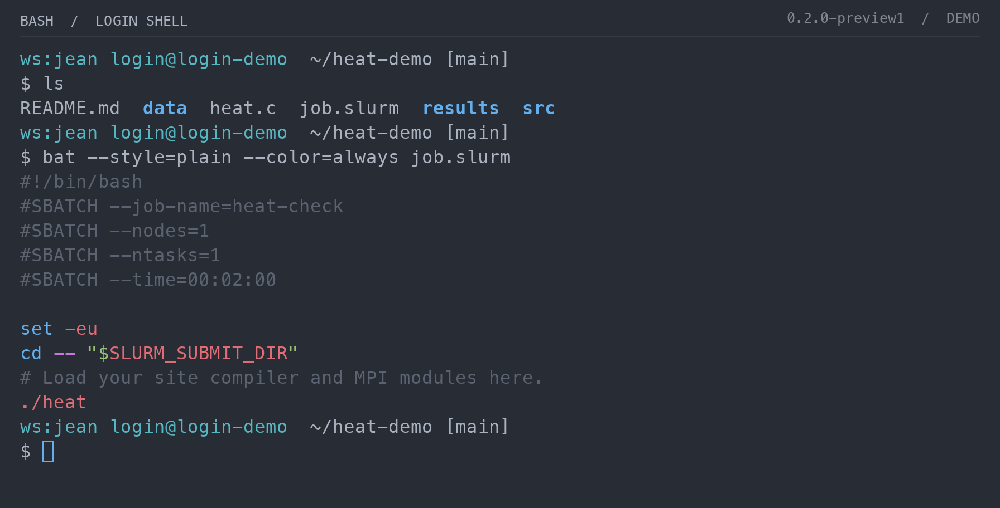
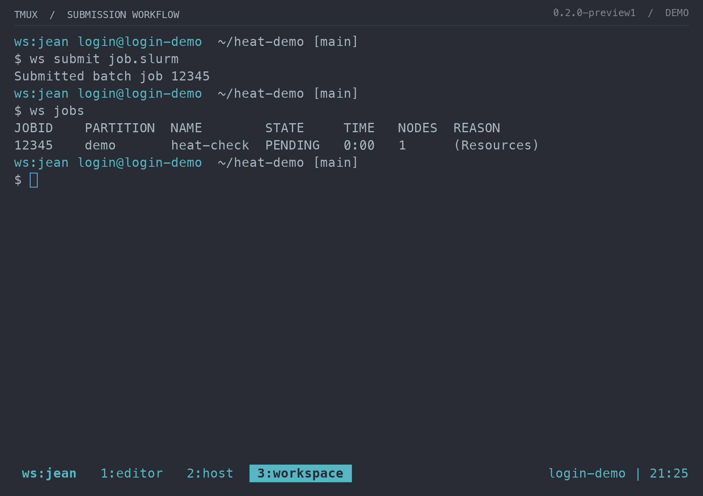
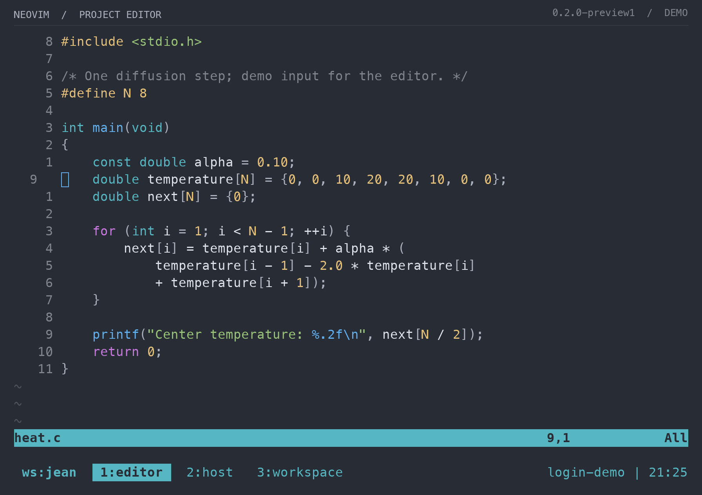

# Workspace views

These views capture Bash, tmux, and Neovim running in the **0.2.0-preview1** image. Captured terminal output is rendered with a monospace font and the suggested client palette. Fonts, cursor rendering, and window borders vary with PuTTY or VS Code settings; the [daily workflow guide](../daily-workflow.md#putty-and-vs-code-appearance) explains those settings.

All project files, hostnames, job IDs, and queue results shown here are local demo data. The submission view uses synthetic native scheduler clients. No cluster was accessed and no real job was submitted for these views.

## Bash and file previews

## Tmux and job submission

The bottom bar switches between the editor, native host shell, and workspace shell. The active window is highlighted.

## Neovim

The editor uses the same palette, relative line numbers, and a persistent project layout.

