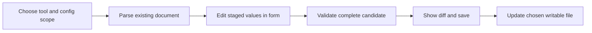

# Terminal forms for workspace configuration

Research date: 24 September 2026. This review examined the then-current [0.6.1-preview1](../releases/0.6.1-preview1.md), which did not package a form tool. **Implementation update, 25 September:** Gum and selected workspace/agent forms are included in [0.7.0-preview1](../releases/0.7.0-preview1.md); Huh and general schema-driven forms remain proposals. The research below records the original evaluation and changed no personal configuration.

**Start with Gum and the existing Python configuration backend; use Huh if a richer maintained form editor becomes warranted.** Huh is the closest match to the remembered Go form library. The name “Tremor” alone does not establish which project was intended. The [integration plan](../guided-configuration.md) starts with a small set of supported settings.

## What the three Charm projects provide

| Project | Delivered interface | What it supplies | Configuration work still required |
| --- | --- | --- | --- |
| [Huh](https://github.com/charmbracelet/huh/blob/v2.0.3/README.md) | Go library, currently imported as `charm.land/huh/v2` | Grouped text inputs, text areas, choices, multiple choices, confirmations, typed values, dynamic fields, and field validation callbacks | Select settings, load existing values, map schema constraints, validate the document, and write files |
| [Gum](https://github.com/charmbracelet/gum/blob/v2.0.1/README.md) | Standalone `gum` executable, callable from shell scripts | Commands such as `input`, `write`, `choose`, `filter`, and `confirm`; selected values go to stdout and confirmation uses exit status | Compose the steps and validation loop in the caller, then parse and update the configuration |
| [Bubble Tea](https://github.com/charmbracelet/bubbletea/blob/v2.0.9/README.md) | Go framework | Application state, event handling, terminal rendering, and input handling | Build the application and its document editing behavior; use Huh when the interface primarily needs forms |

Huh's “standalone” mode means calling a form directly from a Go program. It does not mean an existing `huh edit config.toml` executable. Huh already uses Bubble Tea internally; a separate custom Bubble Tea application becomes useful when the editor needs broader navigation or a persistent multi-pane interface. [Huh tutorial and composition](https://github.com/charmbracelet/huh/blob/v2.0.3/README.md#what-about-bubble-tea)

No schema-to-form loader, YAML/JSON/TOML serializer, or comment-preserving file editor is documented in the examined Huh API or Gum command surface. This is a finding about these interfaces, not a claim about every third-party extension. Huh exposes fields, accessors, and validators; Gum exposes individual terminal commands. Neither should be presented as an automatic configuration editor. [Huh API](https://pkg.go.dev/charm.land/huh/v2@v2.0.3), [Gum command definitions](https://github.com/charmbracelet/gum/blob/v2.0.1/gum.go)

Huh supports `Validate(func(string) error)` for an input. Gum's examined input command has a character limit but no equivalent application-specific validation callback; a script must check the result and reprompt. A form field passing validation does not establish that the whole configuration is valid. [Huh input implementation](https://github.com/charmbracelet/huh/blob/v2.0.3/field_input.go#L214), [Gum input options](https://github.com/charmbracelet/gum/blob/v2.0.1/input/options.go), [Gum input execution](https://github.com/charmbracelet/gum/blob/v2.0.1/input/command.go)

## Proposed integration boundary

The following is a design recommendation, not an implemented command contract:

Keep the form independent of each tool's configuration adapter. A Codex adapter, Claude adapter, or workspace JSON adapter should own the target path, supported version, key names, defaults, and file format. Edit a staged copy, so cancelling cannot mutate the saved document. If Huh is adopted, it updates bound values during interaction, which makes that separation useful. [Huh value updates](https://github.com/charmbracelet/huh/blob/v2.0.3/field_input.go#L325)

For known schemas, map booleans to confirmations, enums to choices, scalar strings to inputs, and simple lists to multiple choices or repeated inputs. Preserve the distinction between an omitted setting and an explicitly set value. Nested objects, unions, arbitrary maps, and conditional constraints need deliberate interface rules; a schema alone does not choose clear labels or a usable layout. Huh supplies the controls, while the adapter owns this mapping. [Huh field API](https://pkg.go.dev/charm.land/huh/v2@v2.0.3)

The proposed writer should preserve unedited keys, compare the source against the version initially read, validate the complete candidate, show the changed lines, and replace the selected file only after Save. Retain its permissions and provide recovery from the prior contents. Preserving comments, ordering, and formatting requires a suitable document parser/patcher and round-trip tests; ordinary decoding and re-encoding is not a preservation contract. Keep an editor escape hatch for unsupported settings. These are application requirements, not Huh or Gum features.

For generic JSON/YAML/TOML files without an application schema, offer structural editing or the existing editor. Do not invent allowed values or label a syntactically valid document as valid application configuration. Per-tool schema details and configuration precedence need separate verification against the packaged tool versions.

## Accessibility and PuTTY

Huh provides `form.WithAccessible(true)`, which uses sequential terminal prompts instead of the Bubble Tea renderer. In v2.0.3, `NewForm` also selects that mode for `TERM=dumb`. Expose a user-controlled basic-prompt option rather than relying only on terminal detection. Its normal form output defaults to stderr, while accessible output defaults to stdout, so explicitly route prompts when stdout is reserved for machine-readable results. [Huh form implementation](https://github.com/charmbracelet/huh/blob/v2.0.3/form.go)

Accessible mode is still interactive. In the examined version, password input requires a terminal file descriptor; the form's accessible loop also discards field-level returned errors. Test EOF, interruption, and failure paths before allowing Save, and do not treat a nil form error as the only save condition. [Huh accessible input](https://github.com/charmbracelet/huh/blob/v2.0.3/field_input.go#L403), [accessible form loop](https://github.com/charmbracelet/huh/blob/v2.0.3/form.go#L679)

Gum's examined `input` implementation runs Bubble Tea and writes its display to stderr; it does not show Huh's basic-prompt fallback. Provide ordinary shell prompting or explicit noninteractive arguments when a Gum-based wizard cannot use a terminal. Bubble Tea's `WithoutRenderer` disables rendering, but does not automatically create a complete accessible form. [Gum input execution](https://github.com/charmbracelet/gum/blob/v2.0.1/input/command.go), [Bubble Tea program options](https://github.com/charmbracelet/bubbletea/blob/v2.0.9/options.go#L81)

PuTTY 0.85 supports UTF-8, 256 colors, and 24-bit color. Its configuration still determines font availability, ambiguous character widths, terminal identification, and some key behavior. Use readable text labels, ordinary keys, and no required Nerd Font symbols. PuTTY's fallback for VT100 line drawing is not a blanket replacement for arbitrary Unicode characters emitted by an application. [PuTTY translation and line drawing](https://the.earth.li/~sgtatham/putty/0.85/htmldoc/Chapter4.html#config-translation), [PuTTY colors](https://the.earth.li/~sgtatham/putty/0.85/htmldoc/Chapter4.html#config-colours)

Before claiming support, test the selected build through actual PuTTY and VS Code SSH sessions, both directly and within the workspace's tmux session. Cover small windows, resize, arrows/Tab/Enter/Backspace, paste, Ctrl-C, basic prompts, and terminal restoration. This research did not run those terminal tests.

## Packaging in the thin SIF

The upstream release pages resolved to [Huh v2.0.3](https://github.com/charmbracelet/huh/releases/tag/v2.0.3), [Gum v2.0.1](https://github.com/charmbracelet/gum/releases/tag/v2.0.1), and [Bubble Tea v2.0.9](https://github.com/charmbracelet/bubbletea/releases/tag/v2.0.9) during this review. These are researched versions, not selected workspace pins.

Gum documents both Linux release binaries and a Nix package. For this workspace, add a deliberately pinned package through the existing Nix release process if the shell wizard earns its place. For Huh, build a workspace-owned executable with pinned Go modules and package that executable in the closure. Do not make users install a Go compiler or fetch dependencies at first use. [Gum distribution](https://github.com/charmbracelet/gum/blob/v2.0.1/README.md#installation), [current toolbox definition](../../image/nix/flake.nix)

Check the build toolchain before selecting current versions: Huh v2.0.3 declares Go 1.25.8 and depends on Bubble Tea v2.0.2; Gum v2.0.1 declares Go 1.26.7 and depends on Bubble Tea v2.0.9. Do not independently upgrade transitive libraries merely to align version numbers. Preserve upstream license notices in the release. [Huh module](https://github.com/charmbracelet/huh/blob/v2.0.3/go.mod), [Gum module](https://github.com/charmbracelet/gum/blob/v2.0.1/go.mod), [Huh license](https://github.com/charmbracelet/huh/blob/v2.0.3/LICENSE), [Bubble Tea license](https://github.com/charmbracelet/bubbletea/blob/v2.0.9/LICENSE)

The executable and schema metadata belong in the immutable tools release; edited configuration belongs in the user's explicitly selected writable location. Initial Apptainer setup must retain native plain prompts or explicit options: a form inside the SIF cannot configure the prerequisite needed to start that SIF. Verify CPU architecture, runtime dependencies, offline execution, and terminal behavior in the actual SIF. A Go implementation or an upstream Linux binary alone is not evidence of compatibility with every cluster.
