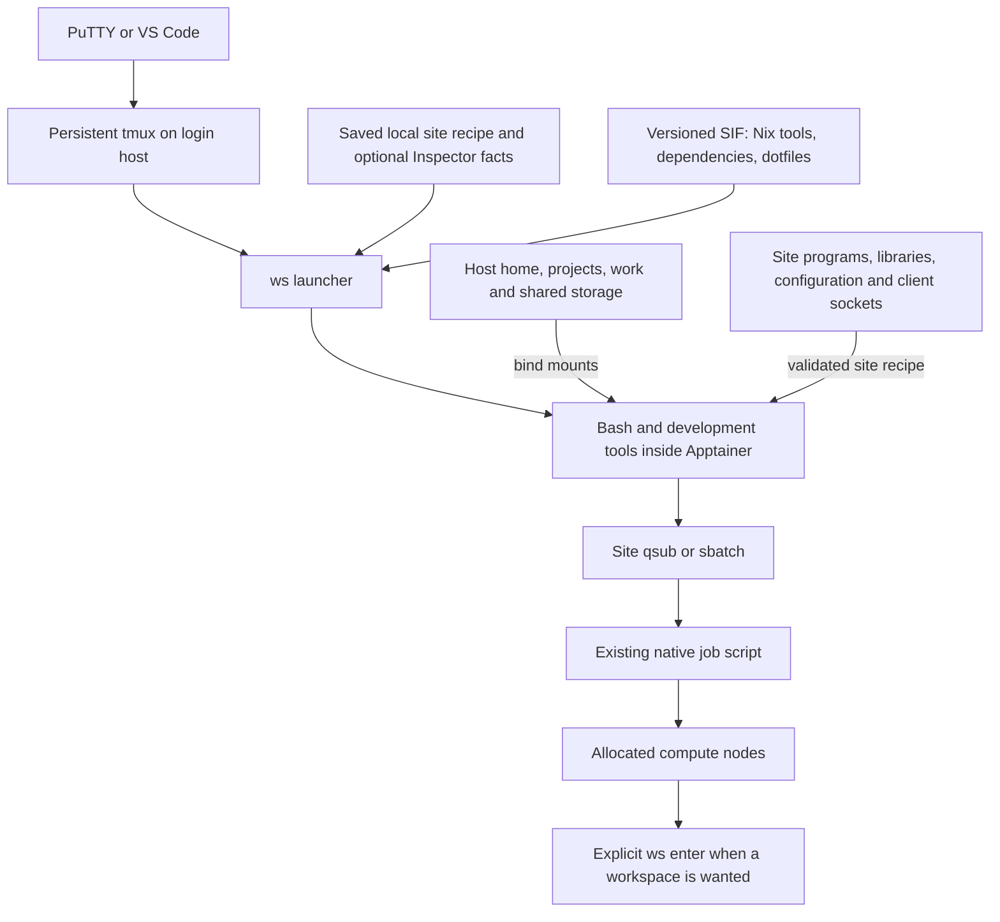

# Thin container with site integration

Date: 2026-09-23. Status: **first implementation in 0.5.0-preview1; the 0.4 artifact remains available**. See the [startup guide](thin-start.md) for implemented behavior and [validation](validation.md) for its tested scope.

This is the implementation direction. The [daily-environment requirements](workflow-options.md) supersede the later host-window-first proposal. A single integrated development shell and automated maintenance across systems are acceptance requirements.

## Goal and recommendation

Enter the development environment and get the same Bash appearance, navigation, editor, agents, and additional tools on each system, while using that system's files, modules, schedulers, and supported software. The experience should resemble setting up tools and dotfiles on one machine; the release and automation make that setup maintainable across all targets.

The requirements are:

- Maintain package definitions, shared dotfiles, the launcher, and integration logic in one repository and release process.
- Build the development tools once per supported release target and ship their dependencies in the image-owned Nix store. Do not build or manually install the toolbox on each cluster.
- Automate installation, release selection, local setup, and updates. Transferring an artifact may remain necessary; independently editing each machine's configuration must not be the routine workflow.
- Generate and cache system-specific settings locally, using available Inspector facts and host observations. Keep private inputs and validation results on the system. Centrally maintained integration logic handles differences; unsupported cases need an actionable local diagnostic rather than guessed settings.
- Make ordinary site commands and development tools usable from the same shell. Separate host/container windows may remain optional, but switching between them is not the design's solution to missing integration.
- Preserve projects, personal overrides, history, credentials, and session state independently of tool-image updates.

Here, **thin container** means a delivery layer for prepared development tools and configuration, with the host system integrated underneath. It does not mean providing only a small set of tools or limiting access to ordinary system workflows. Podman and VS Code are optional capabilities within this design.

**Recommend Nix for the development-tool packages inside the image, with an explicit site integration recipe.** Keep Spack available for scientific stacks and site externals when a workflow needs it; installing both package managers is not a prerequisite. Prove the small Nix tool set and its interaction with site commands before choosing it for the full toolkit.

Open OnDemand's LinuxHost documentation provides a concrete precedent: a base matching the host OS, with host filesystem mounts, can expose software installed on the host to containerized applications. That supports this design approach, but its example mount list is not a verified recipe for Ruth, Jean, or Blueback. We are borrowing the filesystem approach, not adopting OOD's desktop, SSH, or process-management configuration. [OOD LinuxHost](https://osc.github.io/ood-documentation/latest/installation/resource-manager/linuxhost.html)

No private cluster configuration is needed here to build the generic implementation. Actual mount paths, authentication details, local compatibility findings, and Inspector profiles stay on their originating systems. The known working OOD recipe can inform the new local recipe without being uploaded.

## Architecture

The SIF owns the selected development tools and their dependencies. The site owns its clients, compilers, MPI/fabric runtime, drivers, and live configuration. Writable personal files and state remain outside the image. A native batch job does not acquire a container merely because submission happened from the workspace.

The current host tmux server remains the initial session anchor. Its windows can enter the container, and compute windows can enter another instance within an allocation. A login-host process does not migrate to a compute node. The existing layout/state behavior should be retained while the reported startup failure is diagnosed.

## Package manager choice

| Question | Nix inside the image | Spack inside the image |
| --- | --- | --- |
| Selected development tools and private dependencies | Good fit: ship the complete runtime closure under its store paths | Also possible: install a locked tool environment under its chosen prefix |
| Broad host filesystem mounts | `/nix/store` can remain image-owned while a deliberate recipe exposes host OS paths | Its install prefix can remain image-owned too; dependencies and external prefixes must remain valid |
| Site compilers, MPI, and existing software | Separate integration from the general toolbox | Strong fit for explicit compiler and external-package modeling |
| Distribution | Build a Linux image containing the closure, then transfer the SIF | Build an image containing the environment; build caches can also supply packages |
| Changes after publication | Release a new tested image with updated pinned inputs | Release a new tested image with updated locked packages |

The recommendation favors Nix's private development-tool dependency set for this particular image. It is not a claim that Spack cannot package the same tools. Neither package manager supplies scheduler authentication, a functioning module initialization, or MPI compatibility merely by installing packages. The [packaging research](research/thin-container-packaging.md) records the detailed comparison and source evidence. [Nix container builds](https://nix.dev/tutorials/nixos/building-and-running-docker-images.html), [Spack container images](https://spack.readthedocs.io/en/v1.0.0/containers.html), [Spack externals](https://spack.readthedocs.io/en/v1.0.0/packages_yaml.html#external-packages)

Use Nix during the local Linux build, reachable through Docker on the workstation. Pin the package set and sources; include the selected packages and all runtime dependencies in the image at the expected paths. Running those prepared programs does not require installing Nix on the cluster host. The first release should have an immutable tool set, with no package installation at shell startup. Installing new packages interactively into a read-only SIF would be a separate writable-store design.

Keep only intended public commands in the workspace tool directory. Do not prepend every dependency's `bin` directory to `PATH`, and do not make Nix compilers, MPI, Python, or system utilities replace site commands accidentally. Start with Bash, bat, fzf, fd, ripgrep, jq, and Neovim. Add Node and the agents once subprocess behavior passes. Keep the existing pinned agent packages if a suitable tested Nix recipe is not yet available; one tool's packaging exception does not require duplicating the entire tool stack.

## Two explicit filesystem recipes

The broad-access target is **site userspace plus image-owned development tools**. Keep the existing image-userspace behavior as a separate compatibility/reference recipe. These are internal choices saved once in local configuration, not extra options the user must supply on every entry.

### Site userspace recipe: target for OOD-like access

Expose the host's executable and OS-library trees as a coherent set, with its compatible configuration and required site software prefixes. Depending on the actual filesystem layout, that includes relevant `/usr`, `/bin`, `/sbin`, `/lib`, and `/lib64` paths, plus site software under `/opt` or shared storage. Resolve merged `/usr` symlinks and nested mounts deliberately. Do not mount a single host glibc or one loader into an otherwise unrelated image userspace.

Keep `/nix/store` and a workspace-owned configuration/entrypoint prefix visible from the image. The proposed stable prefix is `/workspace-tools`; it must be checked for conflicts with local or administrator-supplied mounts. The existing `/opt/workspace` placement must be accounted for before allowing a host `/opt` mount. Preserve Apptainer's own root metadata rather than binding the host `/` over the container.

Build/test a minimal compatible filesystem scaffold for this recipe. OOD's documented approach starts with a host-matching OS base; one Ubuntu image must not be declared universally suitable simply because the toolbox uses Nix. Aim to reuse the same tool closure and dotfiles across compatible recipes. If a system needs another scaffold, give it a distinct image manifest and the same user interface.

This recipe intentionally depends on the live host OS and site software. Reproducibility means pinned workspace tools plus a recorded, locally validated site recipe; it does not freeze the host installation. Ordinary host updates can invalidate earlier integration checks.

### Image userspace recipe: compatibility/reference option

Retain the image OS and mount selected site software, configuration, and data into it. Direct site clients are supported only if their loader, dependencies, plugins, identity lookup, and authentication work with this recipe. It may be sufficient for a bounded tool set; it should not claim arbitrary host-command parity.

Keep the current `ws submit`/`ws jobs` host connection as an explicit fallback where useful. Its interface is limited and it is not the implementation of an unrestricted host shell. The existing release remains available during the pilot.

## What to mount

| Category | Intended treatment | What must be checked locally |
| --- | --- | --- |
| Home, project, work, shared data | Same absolute paths; writable where normal work needs it | Permissions, symlinks, current directory, availability on the current node |
| Archive storage | Local recipe, present only where the site normally exposes it | Login versus compute access and the site's staging workflow |
| Site program/module trees | Read-only mounts at their expected prefixes | Executables, modulefiles, helper interpreters, libraries and plugin directories |
| OS programs and libraries | Only the complete tested site-userspace recipe may replace these | Loader/libc coherence, merged `/usr`, nested mounts and package helpers |
| Selected `/etc` configuration | Specific files/trees where sufficient; coherent host configuration when that recipe requires it | Scheduler configuration, NSS, resolver behavior, site CA trust and runtime-generated identity files |
| Selected `/run` or `/var/run` client sockets | Bind the necessary live client socket/directory | Ownership, group access, client/daemon protocol and recreation after daemon restart |
| Selected `/var` data | Include only the paths actually required by an application/client | Separate static data from mutable daemon state; no default need for all `/var` |
| `/dev`, `/proc`, `/sys`, GPU/fabric interfaces | Use normal Apptainer and allocation-specific behavior | Scheduler device selection and actual runtime tests |
| Workspace tools and personal state | Image-owned tools; persistent writable home/state; disposable appropriate caches | No mount shadows the tool store, entrypoint, or state destination |

A profile may group mounts into data, site software, site configuration, runtime sockets, and host OS. Each entry records source, destination, mode, required/optional status, and applicable context. Missing required integration fails with a local explanation; a missing optional archive is reported without making the basic workspace unusable. No public profile guesses private mount paths.

An accessible socket can permit operations even through a read-only directory mount; read-only filesystem access is not a restriction on the socket's protocol. Use the same client interface and identity the site supports. In particular, Slurm may require an authentication socket, while a PBS installation may use a helper with privilege requirements. Those are local capability checks, not reasons to copy daemon keys into an image or alter site authentication. [SchedMD container guidance](https://slurm.schedmd.com/containers.html), [OpenPBS installation requirements](https://github.com/openpbs/openpbs/blob/master/INSTALL)

Bind mounts are the delivery mechanism for visible paths, not a complete compatibility test. [Apptainer bind mounts](https://apptainer.org/docs/user/1.3/bind_paths_and_mounts.html)

## Shell, modules, libraries, and subprocesses

The shell should add the workspace experience after the relevant site initialization, then load personal overrides. Compose prompt hooks and retain site command paths. Provide a specific local module initialization hook; copying `MODULEPATH` alone is insufficient to define the `module` shell function or supply its helpers. Avoid blindly replaying an entire login sequence that might enter the workspace recursively. [Lmod initialization](https://lmod.readthedocs.io/en/latest/030_installing.html)

Preserve required site and allocation environment explicitly, including changes made by supported module operations. Keep the normal user identity, working directory, streams, terminal behavior, and exit codes. Application settings should be scoped where practical: setting a workspace editor configuration must not silently redirect configuration for every mounted host application.

Nix dependencies are private paths, but that is not a complete environment firewall. A module's library paths can still interfere with a program's dynamic loading. The test must exercise bat and the editor before and after module changes, and inspect which libraries actually load. Do not globally append Nix library directories or host OpenSSL directories to every process. [Linux dynamic loader](https://man7.org/linux/man-pages/man8/ld.so.8.html)

Scoped wrappers are suitable for leaf tools when a variable needs adjusting. Editors and coding agents also spawn site compilers, terminals, Git helpers, and scheduler clients: unsetting a module variable for the editor also changes what its children inherit. Before calling the integration transparent, test those subprocesses. If needed, prototype a tool-specific loader/wrapper and an explicit site execution environment for editor tasks; verify restoration of the calling module environment. Do not silently send arbitrary commands through the current scheduler connection.

Keep startup reproducible with a documented order: resolve saved settings, validate the requested recipe, construct mounts and environment, enter Apptainer, initialize the site's supported shell/module interface, add selected workspace commands and appearance, then personal overrides. Apptainer adjusts `PATH` and library variables itself, so simply removing `--cleanenv` is not a complete implementation. [Apptainer environment behavior](https://apptainer.org/docs/user/1.3/environment_and_metadata.html)

## Scheduler contract

The desired interface remains ordinary `qsub script.pbs` or `sbatch script.slurm` within the integrated workspace, plus the site's usual query and interactive commands where validated. Use the actual site clients and preserve their arguments, stdin, output, exit status, current directory, and existing script directives. Do not translate resource requests, choose queues/accounts, or inject a development container into native jobs.

Validate four things separately: the client starts, it authenticates as the right user, submission succeeds, and the resulting job runs with its intended environment. Slurm exports the caller's environment by default; PBS `-V` requests broad export. A successful submission alone does not prove that image-only paths or interpreter settings will work in the job. [Slurm sbatch](https://slurm.schedmd.com/sbatch.html), [OpenPBS qsub](https://github.com/openpbs/openpbs/blob/master/doc/man1/qsub.1B)

Keep package-manager build variables out of the interactive runtime. Where needed, a documented submission adapter removes workspace-owned environment changes while retaining user/site/module values. Preserve native CLI export options; do not universally add `qsub -V`, `sbatch --export=ALL`, or `--export=NONE`. Explicitly requested container jobs initialize the selected versioned image in their own script. Test environment behavior with synthetic sentinel variables, ordinary native executable resolution, and a script that never starts the SIF.

The existing bridge captures a host environment at entry and restricts operations. Its current submission flags do not provide this full direct-client contract. Retain it as a named compatibility option; do not disguise it behind native command names without a separate tested adapter. No automatic retry after an uncertain submission outcome.

Interactive allocation and MPI launch are later checks of the same site recipe. A client installed inside the SIF does not allocate a GPU, carry mounts to another node, or launch the workspace there automatically. Start another instance on the allocated node using the saved local settings.

## Saved site configuration and Inspector

Extend the existing private configuration rather than introduce another inventory system. Reuse `ws init`, `ws refresh`, `ws use`, `ws enter`, `ws session`, and `ws doctor`. A saved selection should keep daily startup as `ws enter` or `ws session`; it should not require repeatedly spelling a site or mount list.

Add a versioned integration recipe containing the filesystem strategy, grouped mounts, relevant initialization/environment rules, node-context applicability, and locally verified capabilities. Keep observed Inspector facts separate from user/site overrides and validation results. Inspector's existing system, scheduler, module, MPI, and library facts can seed useful local candidates; they are not automatic proof that a mount, authentication path, or ABI works.

Import an available Inspector profile once, cache the needed facts, and refresh explicitly. Do not run Inspector at every entry or require it for a basic workspace. Reuse `WS_CONFIG_DIR` when clusters share a home directory. A compute allocation can select compute-specific settings using the existing scheduler context; it must not infer facts about other nodes from the login host's local paths.

Generate the local recipe through the installer/launcher from available facts and centrally maintained rules. Configuration is an internal implementation detail, not a set of files the user must maintain independently on every system. Automate refresh and migration when the selected release or relevant local facts change; preserve private overrides and avoid expensive discovery on every startup. Report missing required facts locally rather than guessing them.

New configuration requires a versioned migration that preserves existing overrides, image selection, and personal dotfiles. Dry-run output remains local and shows the planned mounts and environment names rather than secret values. Site validation records stay local and identify the image and recipe revisions they apply to.

## Implementation modules

Keep a small user interface and put the complex behavior behind the existing launcher interface. Do not add a generic backend/plugin framework before there is a concrete need.

| Module or files | Planned work |
| --- | --- |
| New pinned Nix recipe plus `image/Dockerfile` and build helpers | Build the small Linux runtime closure, assemble the SIF-compatible root tree, record versions/dependencies/hashes |
| `lib/configuration.py` and optional Inspector import | Versioned recipe schema, preserved overrides, context selection, local validation metadata |
| `lib/workspace.py` launch planning | Resolve the recipe into an argv/environment plan; check required sources, protected destinations, aliases and mount conflicts; preserve the existing image recipe |
| Container entry, Bash and application configuration | Stable image-owned paths, supported site initialization, selected command exposure, personal settings and tested subprocess behavior |
| `lib/scheduler.py` / `lib/job_bridge.py` | Preserve the explicit legacy interface; implement additional behavior only where the direct-client pilot establishes a need |
| Session startup and diagnostics | Surface an exited pane's status and useful error; preserve other sessions and state; provide targeted local checks |
| Release packaging | Versioned SIF, source/config templates, tool/dependency manifest, checksums, compatibility scope and rollback instructions |

The existing protected-path validation must stay in place for ordinary custom binds. A tested host-OS recipe gets its own deliberate mount construction; it is not implemented by permitting any user bind to replace `/usr` or `/lib`. Reserve the tool store and workspace paths in both recipes. Startup helpers must use their intended interpreter even if host `/usr` or `/opt` is mounted.

## Delivery sequence and acceptance

| Stage | Deliverable | Acceptance before moving on |
| --- | --- | --- |
| 0. Baseline and reported failures | Preserve 0.4, capture the permitted generic tmux/bat symptom or keep diagnosis local | Reproduce the actual error before claiming a fix; this does not block independent design or pilot work |
| 1. Nix tool pilot | Small pinned closure in a candidate SIF, image-owned entrypoint/configuration, no startup downloads | Tools work with synthetic inputs, preserve personal state, and run through Apptainer 1.3.6 and 1.5.3 in the local fixtures |
| 2. Automated integration pilot | Generate and cache a coherent host-userspace recipe; retain the image-userspace reference; synthetic module and scheduler fixtures | The same development shell resolves site commands and tools, preserves group/identity lookup, paths, libraries and module behavior, and runs editor subprocesses and scheduler fixtures without requiring a host window |
| 3. Automated deployment and local acceptance | Apply the same release with repeatable install/update automation on Ruth, Jean and Blueback; keep local facts there | No local toolbox compilation or repeated manual dotfile edits; real query and one approved tiny job, native job environment, interactive allocation, shared storage, actual SIF mounting, update and rollback |
| 4. Daily toolkit | Extend the proven recipe to agents, remaining navigation tools and personal HPC helpers | Real editor/agent subprocess workflow, PuTTY/VS Code shortcuts, offline startup, tmux reconnect and rollback |
| 5. Scientific runtime | Explicit per-project MPI and CUDA/ROCm integration | Result-checked serial, GPU, single-node MPI, then multi-node and GPU-aware tests in allocations |

For local Stage 2, use at least two Linux userspace layouts/families, including a merged `/usr` case; these are public fixtures, not replicas of the protected clusters. Include missing paths, unavailable client sockets, a replaced socket, module library-path changes, spaces in project paths, a shadowed tool prefix, interrupted sessions, and subprocess failure. Stub scheduler fixtures prove argument/environment mechanics, not actual authentication.

The existing Docker Desktop tests use extracted SIF execution because direct nested image mounting was unavailable there. Keep that limitation explicit. Successful Docker or extracted-SIF tests do not establish normal SIF mounting on the clusters. Ruth's PBS path and each Slurm system's path require their own local acceptance; success on one is not proof for another.

## Updates, ownership, and rollout

Build and test on the local Linux builder; publish one versioned release containing the SIF, launcher, shared defaults, integration rules, and checksums. Transfer that release through the existing approved route. The installer/update operation verifies the release, prepares or migrates local integration automatically, and selects the version for new sessions. It must be repeatable without duplicate shell hooks or overwritten personal settings. An update must not require rebuilding the toolbox or independently editing each cluster's dotfiles. Downloaded releases and transferred offline releases use the same installation path.

Keep the public repository free of real site recipes, reports, credentials, and job data. The first pilot uses a new artifact name; it does not replace 0.4 or modify a running session's image. The 0.5 preview implements this offline installation/update path; the startup guide records its current scope.

The workspace maintainer updates Nix/private tool libraries and the image scaffold. Site administrators update the mounted host software. A host patch affects tools actually using that maintained library; it does not rewrite private libraries in the SIF. Keep the previous image, pin new sessions to the selected image, and revalidate affected site capabilities when the image or host runtime changes.

Use one common development-tool set initially. GPU vendors do not require separate editions of fzf, bat, or the editor. Scientific runtimes may later have CUDA/ROCm variants without changing the daily shell experience. Add external SquashFS tool/science payloads only after this basic image-plus-site-recipe workflow works; they add another version/compatibility relationship to manage.

The first implementation milestone is a **Nix-equipped thin SIF with automated integration and deployment**, initially proven with a small tool set. The package set, dotfiles, filesystem view, ordinary site commands, and release update must work together from the same development shell. Expand the toolkit once that foundation passes.
