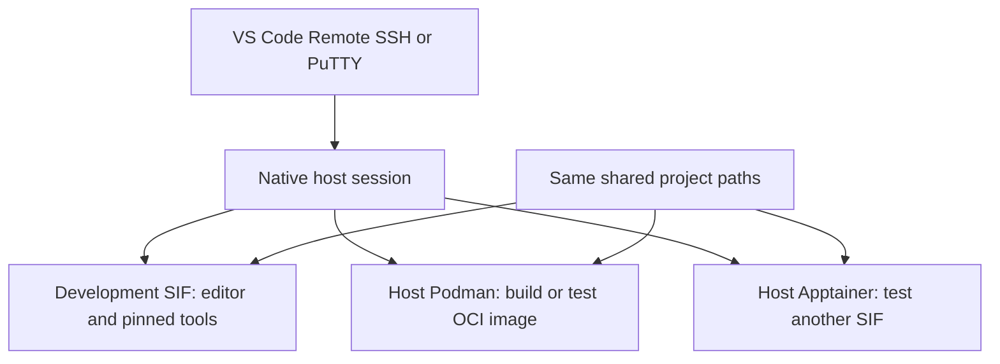

# Daily workspace, remote editing, and container builds

Date: 2026-09-23. Status: **decision proposal for the newly requested alternatives; no runtime migration or new image has been implemented**. The [thin-container plan](thin-container-plan.md) remains available. This note adds the requirement to build and test other people's containers and compares the first implementation choices without assuming the user selected a replacement architecture.

## Recommendation for the first iteration

Use **one versioned workspace configuration, the existing development container, and a native host terminal for scheduler and container-runtime operations**. Offer VS Code Remote SSH as an optional editor/front end alongside PuTTY. Pilot host Podman for OCI builds/tests and host Apptainer for SIF/HPC tests before trying to run a second container runtime inside the development container.

This is a judgment about maintenance effort for an HPC support workflow. It keeps the investment in the SIF and can use the existing `host`, `editor`, and `workspace` session windows. It does not require installing all development tools natively or abandoning the integrated-container design. If one container shell for every operation is the important workflow, evaluate a host Podman client connection next; keep that preference distinct from a technical requirement for nested execution.

The user's belief that Podman is now installed on all targets is a useful lead, not verified capability. Local acceptance must establish the actual versions, permitted build/execution context, storage, user/group behavior, and allocation handling. No cluster access or private configuration export is required for this proposal.

## Separate the choices

| Choice | What it controls | What it does not establish |
| --- | --- | --- |
| PuTTY or VS Code Remote SSH | Connection, terminal/editor interface | A uniform set of Linux command-line programs |
| Shared dotfiles | Appearance, shortcuts and application defaults | Installed binary versions or compatible libraries |
| Nix/Spack/tool packaging | The selected tool versions and dependencies | Scheduler access, device allocations or container-engine permissions |
| Apptainer or Podman | How an application container is built/run | The whole user's shell configuration or every site integration |
| Host versus container command execution | Which filesystem, services and environment a command uses | Where a separate remote runtime service executes its work |

These choices can be combined. VS Code can connect to the host while a terminal enters the development SIF. A containerized editor can edit the same shared project that a host Podman command builds.

## Practical workflow comparison

| Workflow | Main advantage | Maintenance work | Assessment |
| --- | --- | --- | --- |
| Native shell, shared dotfiles, managed native tools | Site modules, schedulers and runtime tools work in their normal context | Deliver compatible tools through an available host package channel | A strong alternative if that channel already exists; not an assumed migration |
| Development SIF plus native host terminal | Consistent packaged tools and straightforward runtime/job control | Shared appearance, explicit execution context, selected file binds | Recommended first pilot with the current project |
| Fully integrated SIF shell for almost every command | One main shell, matching the OOD-style goal | Coherent host binds, library/module interaction, authentication and runtime invocation | Retain the earlier plan; add integration only against real workflows |
| VS Code with a Podman-backed dev container | Convenient project-specific container editing and OCI workflows | Remote server/extension setup, rootless storage, permissions and site integration | Useful optional pilot if it becomes the preferred editor workflow |

A native package manager is not automatically available merely because Podman is installed. Conversely, a Podman-backed workspace would still need the host integration that an Apptainer workspace needs for site commands. Changing engines alone will not remove that work.

## What VS Code adds

Remote SSH installs a VS Code Server on the selected host and runs workspace operations and terminals there. It can edit the remote project without maintaining a separate local source checkout. It does not install bat/fzf/Neovim everywhere or turn the cluster into an identical development environment. The optional VS Code settings should complement the same dotfiles and release manifest used from PuTTY. [Remote SSH](https://code.visualstudio.com/docs/remote/ssh)

There is also a distinction between opening the project over SSH and reopening it in a dev container. Entering `ws enter` in a terminal changes that terminal's command environment; the VS Code extension host and language servers do not automatically move into the SIF. Start with language tools that are available in the chosen editor execution context, or explicitly configure a supported container workflow. Do not promise editor/container integration merely because both can see the same files. [Dev Containers architecture](https://code.visualstudio.com/docs/devcontainers/containers)

Microsoft documents a Podman 5+ CLI configuration for Dev Containers, while the general extension documentation qualifies support for alternate Docker-compatible CLIs. Treat the exact installed combination as a pilot. Apptainer is not a documented drop-in replacement for that Docker/Podman interface. PuTTY remains an independent terminal option; VS Code Remote SSH uses a supported OpenSSH-compatible client rather than PuTTY as its SSH transport. [Alternate engines](https://code.visualstudio.com/remote/advancedcontainers/docker-options), [Dev Containers requirements](https://code.visualstudio.com/docs/devcontainers/containers)

Check the selected host against the dedicated current Linux prerequisites page and ensure the site's normal route permits the remote server and chosen extensions. Avoid relying on older distribution/version examples elsewhere in the SSH guide. Heavy builds, indexing and tests should use the site's appropriate execution resources; an editor connection does not acquire an allocation. [Linux prerequisites](https://code.visualstudio.com/docs/remote/linux)

## Podman and Apptainer have complementary roles

The proposed division is host Podman for Dockerfile/Containerfile builds and OCI behavior, and host Apptainer for SIF behavior and the existing HPC delivery workflow. Podman uses Buildah for image builds; Apptainer can consume supported OCI/archive sources. Build the generic tool image once from pinned sources and derive the needed runtime artifacts. Test the original OCI behavior and the converted SIF separately: conversion is not evidence that entrypoints, identity, bind mounts, MPI or GPU behavior are equivalent. [Podman overview](https://docs.podman.io/en/latest/markdown/podman.1.html), [Apptainer build sources](https://apptainer.org/docs/user/1.3/build_a_container.html)

Keep the existing local Docker builder for generic public images. Use site Podman when the user's support task needs a build or reproduction there and the site supports it. An Apptainer definition containing build commands needs its own supported build/fakeroot setup; archive-to-SIF conversion and a full definition build are different operations.

Rootless Podman image/layer storage needs a supported filesystem; do not assume its default location under a shared home will work. A local image store and bind-mounted shared project files are different things. Export required finished images to persistent storage before a job ends or temporary node storage is purged. The [runtime/build research](research/container-build-workflows.md) records the detailed prerequisites and checks.

## Starting another container from the workspace

The simplest first implementation is to invoke the native runtime in the existing host window, on the appropriate host or within the allocation where the work belongs:

For a later same-shell option, a Podman client inside the development container can call a same-user host Podman service over a Unix socket. The service launches another container on its host; the new runtime is not nested inside the development SIF. The client and service need compatible behavior, and bind sources must exist at the paths seen by the service. [Podman service](https://docs.podman.io/en/latest/markdown/podman-system-service.1.html)

That socket carries the service user's full Podman authority, so expose it deliberately to the trusted development environment, not by default to arbitrary customer/test images. A client running in a compute allocation does not move a login-node service or its work into that allocation. Validate service placement, group access, devices, cgroups, cancellation and cleanup. Prefer direct runtime commands within the allocation until that contract works.

True nested Apptainer or Podman execution can work in supported configurations, but it adds namespace, storage, device and environment dependencies. It should be a specific tested capability rather than a prerequisite for opening a shell. Binding a host runtime executable into the SIF still executes it within the current container context; it does not itself call an outside host process. Apptainer's nested-bind behavior is documented, so the proposal does not claim nesting is universally impossible. [Apptainer nested binds](https://apptainer.org/docs/user/1.3/bind_paths_and_mounts.html), [build/runtime research](research/container-build-workflows.md)

## Concrete first implementation slice

1. **Extract reusable appearance and shell configuration.** Provide a common configuration plus separate host/container loaders. Preserve site startup, prompt hooks and personal overrides. Label the command context with ordinary text. The current Bash file resets `PATH` and `PROMPT_COMMAND` and must not simply be sourced on the host. Enable tool-dependent shortcuts only where the required tool is available; the host and SIF do not initially promise identical installed commands.
2. **Make the current session reliable and understandable.** Keep host control and container development windows on the same project. Surface failed pane startup without hiding the native window or destroying user state. Diagnose the reported tmux/bat symptoms against exact local evidence; a workflow proposal is not a fix claim.
3. **Prove one complete container build/test workflow.** Use a small public fixture: native Podman builds/runs an OCI image, the supported archive route produces a SIF, and native Apptainer runs it. Check exit status, file ownership/group access, streams, working directory and cancellation. Detailed site results remain local.
4. **Add a small VS Code companion configuration.** Optional Remote SSH guidance, editor settings, terminal context labels and explicit project tasks. PuTTY gets the same terminal defaults. No new SSH service inside the SIF is required for the first pilot.
5. **Then improve package delivery and integration.** Continue the Nix tool pilot inside the image for reproducible versions. If the two-context workflow is comfortable, expand the tools without full host-OS mounting. If one container shell is preferred, continue the OOD-style mount recipe and separately pilot the host Podman client connection. Neither outcome requires changing the scientific runtime prematurely.

The first slice deliberately builds on the existing release. It is not a new full native-tool distribution project, a new container engine installation, or a claim that all site-dependent work can run in the SIF today.

## Sustainability and acceptance

Keep portable configuration and package recipes in this repository, pin tools and image inputs in a release manifest, and use an explicit update/rollback workflow. Keep local site facts, runtime paths, credentials and test results separate. Shell startup should load selected releases, not download the newest tools. Personal overrides survive updates.

Success means the same project can be opened from PuTTY or optional VS Code; the host pane retains native scheduler/module/runtime behavior; the development pane supplies the selected pinned tools; changes to shared files are visible in both; a representative container can be built and tested using the site's supported runtime; and reconnect/update behavior preserves personal state. Check the actual image execution on the clusters, not only the existing Docker/extracted-SIF fixtures.

If Podman is unavailable or its local build setup is unsupported, the existing workstation build-and-transfer path remains usable. If VS Code is unavailable, the same workspace still works from PuTTY/tmux. The preferred daily interaction should guide later integration work; these fallbacks do not authorize a silent change to the user's selected container design.
